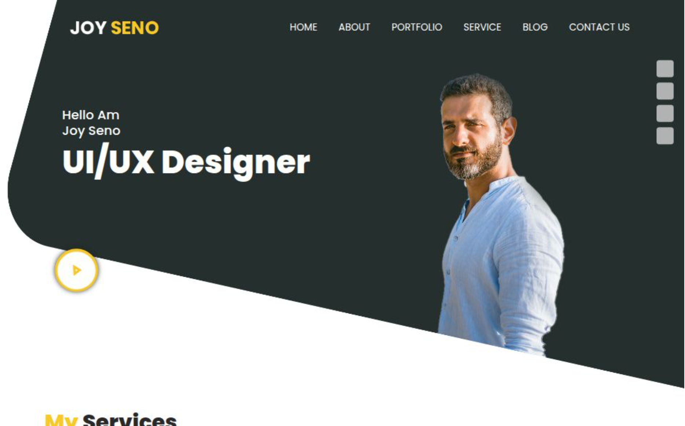

# PR-BT-JoySeno

A responsive and modern **UI/UX Designer Portfolio Website** built with HTML, CSS, and JavaScript.  
This site showcases design skills, portfolio work, services, and contact information for potential clients or employers.

## 🚀 Live Demo
[View Website](https://pr-bt-joy-seno.vercel.app/)

---

## 📌 Features
- **Responsive Design** – Optimized for desktops, tablets, and mobile devices.
- **Smooth Navigation** – Scroll-based navigation with a clean UI.
- **Portfolio Showcase** – Display of selected design projects.
- **Services Section** – Clear listing of offered services.
- **Blog Section** – Space for articles, tips, and updates.
- **Contact Form** – Easy-to-use form for client inquiries.
- **Custom Styling** – Elegant typography, color palette, and branding.

---

## 🛠️ Technologies Used
- **HTML5** – Structure and semantic markup.
- **CSS3** – Styling with responsive layouts.
- **JavaScript (Vanilla)** – Interactivity and dynamic effects.
- **Bootstrap** – Grid system and UI components.
- **Vercel** – Hosting and deployment.

---

## 📂 Folder Structure

.
├── index.html
├── about.html
├── portfolio.html
├── services.html
├── blog.html
├── contact.html
├── css/
│ ├── style.css
│ └── media.css
├── js/
│ └── main.js
├── images/
└── README.md

## 📸 Screenshots

